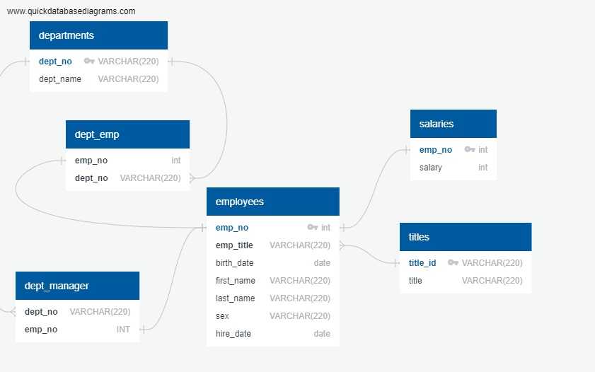

# SQL-Challenge

## Background

I have been hired as a new data engineer at Pewlett Hackard. My first major task is a research project on employees of the corporation from the 1980s and 1990s. All that remain of the database of employees from that period are six CSV files found [here](EmployeeSQL/data).

In this assignment, I will design the tables to hold data in the CSVs, import the CSVs into a SQL database, and answer questions about the data.

## Data Modeling

An entity relationship diagram (ERD) was created to describe the data in the six CSV files.  The ERD visualizes the relationships between data objects and describes the data types of each object.

## Data Engineering

A sql schema was created for each of the six CSV files based on the ERD diagram.  Data types, primary keys, and foreign keys are identified in the schema.  The tables can be found  here: [Employee_Tables](EmployeeSQL/employee_tables.sql)

## Data Analysis

The questions that will be answered by this data analysis are as follows:

1. List the following details of each employee: employee number, last name, first name, sex, and salary.

	   Select employees.emp_no, last_name, first_name, sex, salary
	       from employees, salaries
		   where employees.emp_no = salaries.emp_no;

2. List first name, last name, and hire date for employees who were hired in 1986.

		Select first_name, last_name, hire_date from employees
		    where extract(year from hire_date) = '1986';

3. List the manager of each department with the following information: department number, department name, the manager's employee number, last name, first name.

		Select d.dept_no,d.dept_name, dm.emp_no, e.last_name, e.first_name from dept_manager as dm
		left join employees as e
			on e.emp_no = dm.emp_no
		left join departments as d
			on dm.dept_no = d.dept_no;

4. List the department of each employee with the following information: employee number, last name, first name, and department name.

		Select d.dept_no,d.dept_name, de.emp_no, e.last_name, e.first_name from dept_emp as de
		left join employees as e
			on e.emp_no = de.emp_no
		left join departments as d
			on de.dept_no = d.dept_no;

5. List first name, last name, and sex for employees whose first name is "Hercules" and last names begin with "B."

		Select first_name, last_name, sex from employees
		where employees.first_name = 'Hercules'
		and employees.last_name like 'B%';

6. List all employees in the Sales department, including their employee number, last name, first name, and department name.

		Select dept_emp.emp_no, employees.last_name, employees.first_name, departments.dept_name from employees
		left join dept_emp 
			on dept_emp.emp_no = employees.emp_no
		inner join departments 
			on departments.dept_no = dept_emp.dept_no
			where departments.dept_name like '%Sales';

7. List all employees in the Sales and Development departments, including their employee number, last name, first name, and department name.

		Select de.emp_no, e.last_name, e.first_name, d.dept_name from employees as e
		left join dept_emp as de
			on de.emp_no = e.emp_no
		inner join departments as d
			on d.dept_no = de.dept_no
			where d.dept_name like '%Sales'
			or d.dept_name like 'Development';

8. In descending order, list the frequency count of employee last names, i.e., how many employees share each last name.

		Select last_name, count(last_name) as "Name Count"
			from employees
			Group BY last_name
			Order by "Name Count" DESC;
